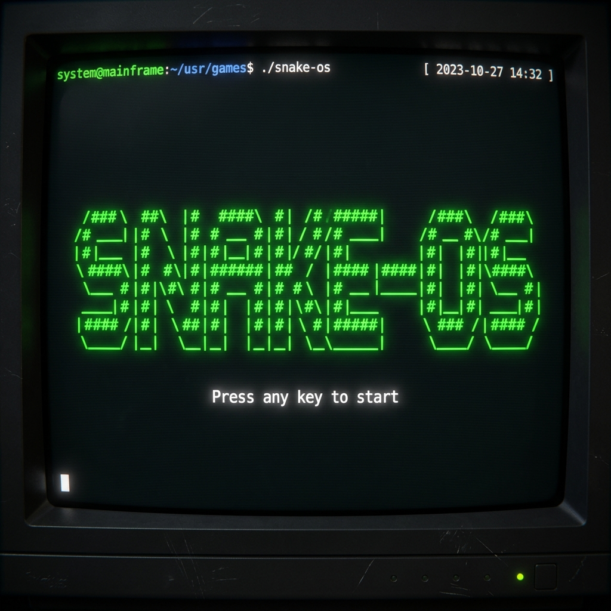
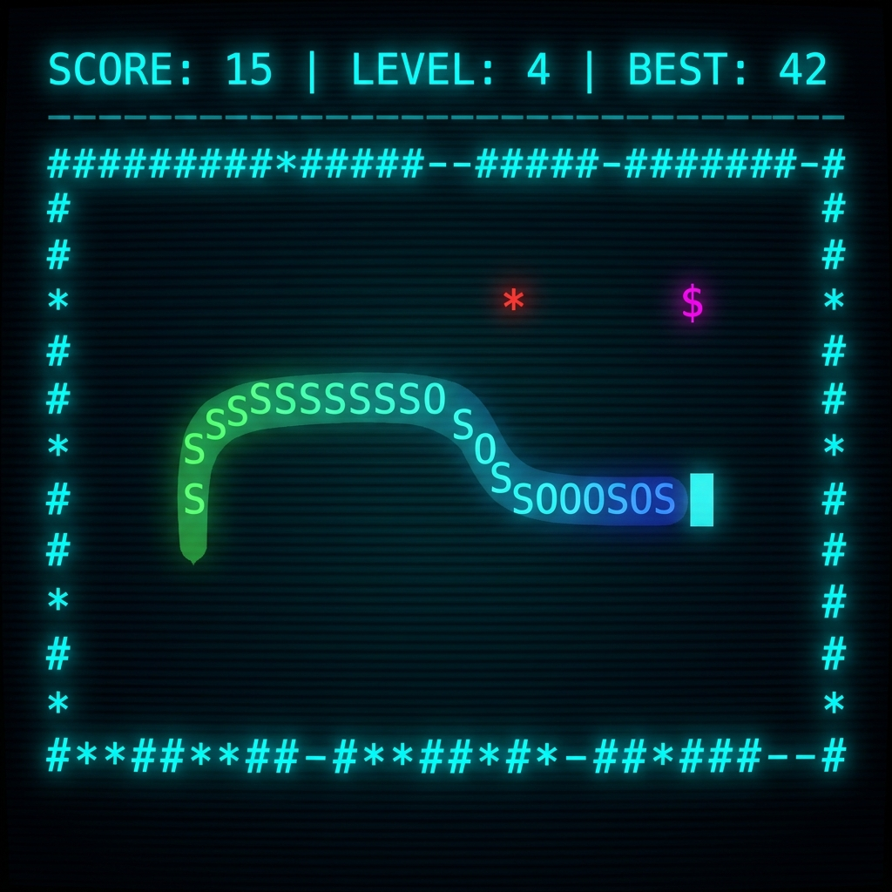

# 🐍 Snake-OS

<div align="center">
  
</div>

### **A Bare-Metal, High-Fidelity Terminal Gaming Experience**
**Snake-OS** is a masterclass in low-level C programming. Built entirely without the C Standard Library (`stdlib.h`), it interacts directly with the operating system and terminal via custom-built memory allocators, math libraries, and ANSI rendering engines.

---

## 👥 Authors
- **Pintu Singh** (230105)
- **Pranay Sarkar** (230047)
- **Fathal** (230043)

---

## 🎮 Game Features & Modes

### 🔄 Dual Gameplay Modes
Switch between two distinct playstyles on the title screen using the **[M]** key:
- **INFINITY MODE**: Teleport across boundaries for a smooth, high-speed Zen experience.
- **CLASSIC MODE**: Walls are lethal. Precision and planning are required.

### 🌈 Visual & UX Excellence
- **Vibrant Color Cycling**: The snake evolves through 6 distinct color phases (Green → Cyan → Magenta → Yellow → Red → Blue) as you level up.
- **Gradient Physics**: A custom "fade-to-black" tail effect using ANSI dimming (Bold → Normal → Dim).
- **Directional Sprites**: The head dynamically changes to `^`, `v`, `<`, or `>` based on your movement.
- **Interactive Feedback**: 
  - **Animated Countdown**: A high-stakes 3-2-1-GO sequence before each round.
  - **Score Popups**: Floating text (`+1`, `+3`, `+5`) appears exactly where food is eaten.
  - **Death Animation**: A dramatic red-flash sequence when the snake hits itself.

### 🕹️ Advanced Mechanics
- **Dynamic Difficulty**: Speed increases by 5% every level, keeping the challenge alive.
- **Multi-Tier Food System**:
  - `*` (Regular): 1 Point.
  - `$` (Bonus): 3 Points. Spawns on a timer.
  - `#` (Super): 5 Points. Rare and high-stakes.
- **Blinking Expire System**: Timed food blinks when it's about to vanish!

<div align="center">
  
</div>

---

## 🛠️ Technical Prowess
- **Memory**: Custom block-allocator using a static 8KB VRAM buffer.
- **Rendering**: Direct ANSI escape sequence injection for zero-latency UI updates.
- **Resizing**: Real-time terminal resize detection via `ioctl`. Game pauses if the window is too small.
- **Zero-Dependency**: No `malloc`, `free`, `printf`, or `math.h` functions used.

---

## ⚙️ Setup & Installation Guide

### 1. Prerequisites
Ensure you have a C compiler and `make` installed:
- **macOS**: `brew install gcc make`
- **Ubuntu/Linux**: `sudo apt install build-essential`

### 2. Clone and Compile
```bash
make clean && make
```

### 3. Launching the Game
```bash
./snake
```

---

## ⌨️ Controls & Commands

| Key | Action |
| :--- | :--- |
| **`W` / `↑`** | Move Up |
| **`A` / `←`** | Move Left |
| **`S` / `↓`** | Move Down |
| **`D` / `→`** | Move Right |
| **`M`** | **Toggle Mode** (Title Screen) |
| **`P`** | **Pause Game** |
| **`R`** | **Restart** (Game Over) |
| **`Q`** | **Quit Game** |

---

## 📜 Version History

### **v1.3.1** (The Mode Update)
- Added **Mode Selection** (Infinity vs Classic).
- Added **M-key toggle** on Title Screen.
- Finalized **Premium Visuals** in README.

### **v1.3.0** (The Polish Update)
- Added **3-2-1 Countdown** and **Pause Menu**.
- Implemented **Score Popups** and **Death Animation**.
- Integrated **Blinking Timer** for bonus food.

### **v1.2.0** (The Visual Update)
- Added **Gradient Tails** and **Directional Head Sprites**.
- Implemented **Color Cycling** (6 levels).

---

## 📁 Repository Structure
- `src/snake.c`: Core Engine & Game Loop
- `src/memory.c`: Static VRAM Manager
- `src/screen.c`: ANSI Rendering Engine
- `src/keyboard.c`: Raw Mode Input Handler
- `include/`: Header Definitions